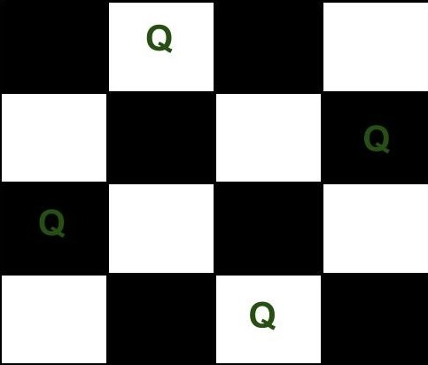
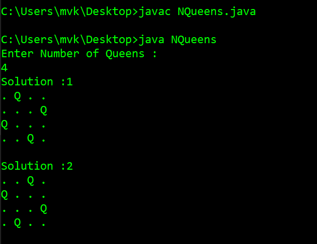

# N-Queen-Problem

Solving N-Queen Problem using Backtracking

* The N Queen is the problem of placing N chess queens on an N×N Chessboard so that no Two Queens attack each other.

* In order,to understand the problem of N-Queen 

Let us Consider a 4 X 4 Chessboard as shown below,

   

* The N-Queen problem says that if the Queen is placed intially on (1,2), then the following Next Queen on ChessBoard cannot be placed at (2,1) or (2,2) or (2,3) since it violates the Queen rule and thereby Queen attacking is possible.

* In this way,we must arrange all the Queens and place on the ChessBoard.

## Output :

   

- The above is the diffrent solutions produced when Number of Queens taken are '4'.

#### >>> One Interesting Fact about N-Queen Problem is if we consider 8 X 8 Chessboard - it provides 92 Solution !! that is 92 ways of placing 8 Queens following all the rules of adjacent Queen Attack!!

                                                    Happy Coding :)

